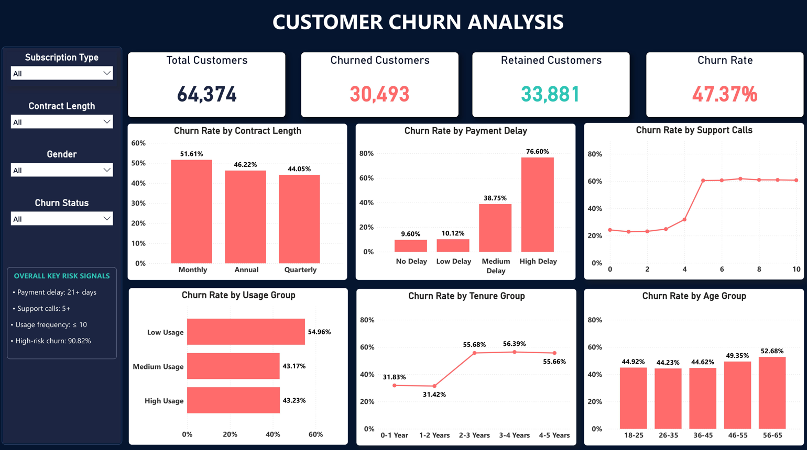

# Customer Churn Analysis

An end-to-end data analytics project focused on identifying customer churn patterns and high-risk customer segments for a subscription-based business.

## Dashboard Preview

## Project Objective

The objective of this project is to analyze customer behaviour, identify the key factors associated with churn, and provide practical recommendations that may help improve customer retention.

## Tools Used

* Python and Pandas – data cleaning and feature creation
* MySQL – business analysis using SQL
* Power BI – DAX measures, interactive visualizations, and dashboard development

## Dataset Overview

* Total customers: 64,374
* Total columns after preparation: 15
* Missing values: 0
* Duplicate records: 0
* Churned customers: 30,493
* Retained customers: 33,881
* Overall churn rate: 47.37%

The dataset represents customers of a generic subscription-based business. The exact company and product are not specified.

## Data Preparation

The following steps were completed using Python:

* Inspected the dataset structure and data types
* Checked for missing values and duplicate records
* Validated numerical ranges and categorical values
* Standardized column names using snake_case
* Cleaned and standardized text columns
* Verified unique customer IDs
* Created age and tenure groups
* Created readable churn-status labels

## SQL Analysis

The SQL analysis explored:

* Overall customer churn rate
* Churn by contract length
* Churn by payment-delay group
* Churn by support-call count
* Churn by usage-frequency group
* Churn by tenure group
* Churn by subscription type
* Churn by age group
* Churn by total-spend group
* High-risk customer identification

View the complete SQL analysis: [customer_churn_analysis.sql](customer_churn_analysis.sql)

## Key Insights

* The overall customer churn rate is 47.37%.
* Customers with high payment delays have a 76.60% churn rate.
* Customers making five or more support calls have an approximately 60% churn rate.
* Low-usage customers have the highest usage-based churn rate at 54.96%.
* Customers with more than two years of tenure show churn rates of approximately 56%.
* Monthly-contract customers have the highest contract-based churn rate at 51.61%.
* Customers aged 56–65 have the highest age-group churn rate at 52.68%.
* Low-spend customers have a higher churn rate than high-spend customers.
* Customers meeting all three high-risk conditions have a 90.82% churn rate:

  * Payment delay of 21 days or more
  * Five or more support calls
  * Usage frequency of 10 or less

## Business Recommendations

* Identify high-risk customers early using payment delay, support calls, and usage frequency.
* Send payment reminders before and after subscription due dates.
* Escalate customer issues before they reach five support calls.
* Provide onboarding guidance and engagement campaigns to low-usage customers.
* Offer loyalty rewards and retention benefits to long-term customers.
* Monitor campaign results regularly to determine whether churn decreases.

## Dashboard Features

* KPI cards for total, churned, and retained customers
* Overall churn-rate measurement
* Interactive slicers for subscription type, contract length, gender, and churn status
* Churn analysis across payment delay, support calls, usage, tenure, age, and contract length

## Project Files

* [Dashboard Preview](Customer_Churn_Dashboard.png)
* [SQL Analysis](customer_churn_analysis.sql)

## Important Note

The findings show associations within this dataset. They do not prove that any single factor directly causes customer churn.

## Author

**Jaganathan S**
Aspiring Data Analyst
Skills: Excel, SQL, Python, Power BI, and Tableau
